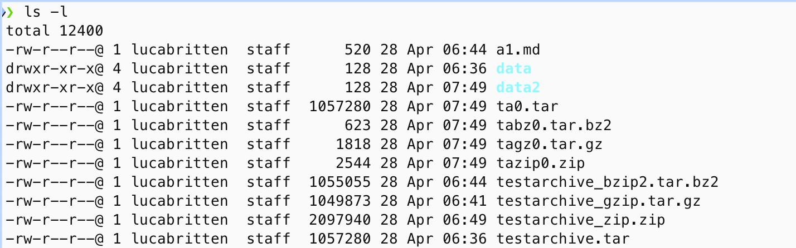

# Aufgabe 1

1. Erzeugen der 1MB großen Datei mit zufälligen Bits

```bash
    dd if=/dev/urandom of=testfile bs=1M count=1
```

2. Hardlink auf testfile erstellen

```bash
    ln testfile testlink
```

- Notiz: Cmd _ls -li_ zeigt die Inode-Nummern der Dateien --> gleich bei Hardlink

3. tar-archiv erstellen

```bash
    tar -cf testarchive.tar data/
```

- -c erstellt ein neues Archiv
- -f schreibt Archiv in spezifizierte Datei

```bash
    tar -czf testarchive_gzip.tar.gz data/
```

- -z Filtern mit gzip(1)

```bash
    tar -cjf testarchive_bzip2.tar.bz2 data
```

- -j Filtern mit bzip2(1)

Notiz: Unterschied gzip und bzip2 --> gzip ist schneller und verbraucht weniger Resourcen, bzip2 erreicht hingegen eine höhere Komprimierungsrate, ist dafür aber langsamer und rechenintensiver

4. Zip-Archiv erstellen

```bash
    zip -r testarchive_zip.zip data/
```

- -r Flag, um sub-direectories zu beinhalten

5. Vergleichen der Dateigrößen

```bash
    ls -l
```

- Zufällig generierte Datei lässt sich nicht komprimieren, da es keine Muster gibt
- Gegensätzich entsteht durch Speicherung von Metadaten sogar ein Overhead

6. Vergleich mit Datei, welche nur aus 0en besteht

```bash
    mkdir data2
    cd data2
    dd if=/dev/zero of=testfile0 bs=1M count=1
    ln testfile0 testlink0
    cd ..
    tar -cf ta0.tar data2/
    tar -czf tagz0.tar.gz data2/
    tar -cjf tabz0.tar.bz2 data2/
    zip -r tazip0.zip data2/
```


